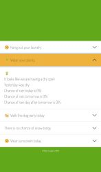

# Automated Laundry Forecast Tool

**Overview:**

The Automated Laundry Forecast Tool is an innovative utility designed to assist homemakers with more effective use of their time. This tool interfaces with the MET Office API to assess the risk of rain and provides timely information on whether laundry can safely be left to dry outdoors throughout the day. This allows the user to focus on more engaging tasks without concern for unpredictable weather disruptions. 

**Key Features:**

1. **[Integration with MET Office API](./application/rain.py):** The tool establishes a secure connection with the MET Office API, retrieving the most accurate daily weather forecast based on pre-specified location coordinates. 

2. **[Dynamic Weather Data Object](./application/rain.py) :** After the retrieval process, the tool generates a dynamic weather data object. This object holds the received weather data and facilitates the seamless passing of information between various code segments, enhancing the system's overall flexibility and efficiency.

3. **[Responsive Display based on API Results](./application/templates/detail.html) :** With the assimilated data, the tool generates a user-friendly interface that presents forecast results in a clear and concise manner. The tool's display varies responsively, reflecting the retrieved results from the MET Office API and thus providing the user with timely and pertinent information.

4. **[Adaptive Bootstrap & CSS Styling](./application/static/styles/styles.css):** The Automated Laundry Forecast Tool employs bootstrap and CSS to dynamically modify the presentation of elements on the webpage, contributing to an engaging and intuitive user experience. This ensures the page layout is both aesthetically pleasing and informative, catering to the user's need for concise, clear, and actionable weather information.

### Home Page

### Results Page

